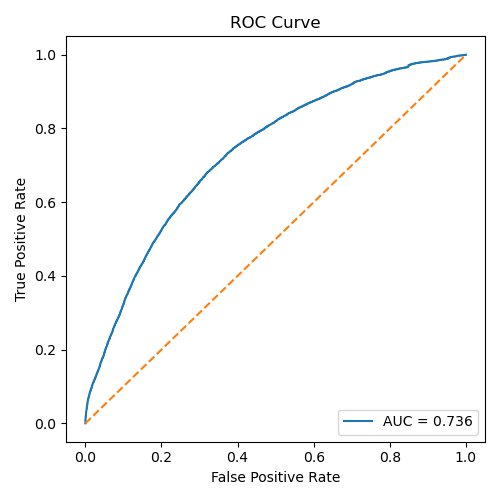

# HPO-GNN-Diagnosis

Phenotype-driven disease ranking with the Human Phenotype Ontology (HPO).  
This pipeline learns **term embeddings** from the HPO graph, pools them into **disease embeddings** using HPOA, and ranks candidate diseases for patients described by HPO terms (Phenopackets).

---

## What’s included

- **IC with ancestor propagation** (`src/compute_ic.py`) for robust term weighting.
- **GCL (graph contrastive learning)** over the HPO DAG → dense term embeddings.
- **Disease embeddings** from IC × frequency, with **optional ancestor expansion**.
- **Patient embedding** with ancestor expansion and optional subtraction of **negated** HPOs.
- **Evaluation** (`src/evaluate.py`) with:
  - Exact-ID metrics (Top-K, MRR, ROC/AUC).
  - **MONDO canonicalization** (OMIM/ORPHA/DECIPHER → MONDO) so synonyms count.
  - **IC-aware phenotype-overlap filtering** to shrink the candidate set before ranking.
  - Flexible reporting: multiple Top-K via `--report_top`.

---

## Setup

```bash
# Python 3.9–3.11 recommended
python -m venv .venv
source .venv/bin/activate          # Windows: .venv\Scriptsctivate
pip install --upgrade pip

# Core dependencies
pip install torch torch-geometric transformers obonet networkx scikit-learn matplotlib
```

### Required data (put in repo root or pass paths via CLI)

- `hp.obo` — Human Phenotype Ontology  
- `phenotype.hpoa` — HPO disease ↔ term annotations  
- `phenopackets/` — directory of Phenopacket v2 JSONs (your cases)  
- *(optional but recommended for eval)* `mondo.obo` — MONDO Disease Ontology

Get MONDO (latest):

```bash
curl -L -o mondo.obo http://purl.obolibrary.org/obo/mondo.obo
```

---

## Quickstart (end-to-end)

Artifacts are written to `checkpoints/`.

### 1) (Optional) TSDAE on HPO text

```bash
python src/hpo_tsdae.py --hpo_obo hp.obo --epochs 3
# → checkpoints/hpo_tsdae_encoder/
```

### 2) HPO Graph Contrastive Learning (GCL)

```bash
python src/hpo_gcl.py   --obo hp.obo   --tsdae_ckpt checkpoints/hpo_tsdae_encoder   --epochs 100
# → checkpoints/node_list.pt, checkpoints/hpo_gcl_embeddings.pt
```

### 3) Information Content (IC) with ancestor propagation

```bash
python src/compute_ic.py
# → checkpoints/hpo_ic.pt
```

### 4) Aggregate disease embeddings (IC × frequency)

**Baseline:**
```bash
python src/aggregate_disease_embeddings.py   --node_list checkpoints/node_list.pt   --term_embs checkpoints/hpo_gcl_embeddings.pt   --hpoa phenotype.hpoa   --ic checkpoints/hpo_ic.pt
# → checkpoints/disease_ids.pt, checkpoints/disease_embs.pt
```

**Recommended (mirror patient ancestor expansion):**
```bash
python src/aggregate_disease_embeddings.py   --node_list checkpoints/node_list.pt   --term_embs checkpoints/hpo_gcl_embeddings.pt   --hpoa phenotype.hpoa   --ic checkpoints/hpo_ic.pt   --obo hp.obo   --ancestor_depth 2 --ancestor_decay 0.7
```

### 5) Single-patient diagnosis (sanity check)

```bash
python src/diagnose.py   --obo hp.obo   --term_node_list checkpoints/node_list.pt   --term_embs checkpoints/hpo_gcl_embeddings.pt   --disease_ids checkpoints/disease_ids.pt   --disease_embs checkpoints/disease_embs.pt   --patient_hpos "HP:0001250,HP:0001263,HP:0001249"   --topk 10
```

### 6) Batch evaluation

**Baseline (exact IDs, full candidate set):**
```bash
python src/evaluate.py   --phenopackets_dir phenopackets   --k 5   --hpoa phenotype.hpoa   --obo hp.obo   --ic checkpoints/hpo_ic.pt   --report_top 5 10 50 100
```

**Recommended (synonyms + IC-aware filtering):**
```bash
python src/evaluate.py   --phenopackets_dir phenopackets   --k 5   --hpoa phenotype.hpoa   --obo hp.obo   --mondo mondo.obo   --ic checkpoints/hpo_ic.pt   --filter_by_overlap --filter_depth 1   --filter_min_terms 3 --filter_min_ic 3.0 --filter_keep_top 300   --report_top 5 10 50 100
```
This configuration:
- canonicalizes IDs via **MONDO** so ORPHA/DECIPHER hits count for OMIM golds,
- keeps only diseases that meaningfully **overlap** the patient phenotype (by term count + IC),
- ranks the pruned set by cosine similarity.

---

## Key scripts & options

- `src/compute_ic.py` — Resnik-style IC with ancestor propagation over HPOA.
- `src/hpo_gcl.py` — Graph contrastive learning to get term embeddings.
- `src/aggregate_disease_embeddings.py`
  - `--ancestor_depth / --ancestor_decay` for disease-side ancestor expansion (0 disables).
- `src/diagnose.py`
  - Patient embedding with ancestor expansion; optional subtraction of negated HPOs.
  - Clamps Top-K to available candidates (prevents `topk out of range`).
- `src/evaluate.py`
  - `--mondo mondo.obo` → synonym-aware scoring (OMIM/ORPHA/DECIPHER → MONDO).
  - `--filter_by_overlap` → enable phenotype-overlap filtering.
    - `--filter_depth` (patient ancestor expansion depth for the overlap set)
    - `--filter_min_terms` (min overlapping HPOs to keep a disease)
    - `--filter_min_ic` (min IC sum of overlaps to keep a disease)
    - `--filter_keep_top` (cap candidates by overlap-IC before ranking)
  - `--patient_depth / --patient_decay` → tune patient pooling.
  - `--report_top` → print multiple Top-K/MRR (e.g., `5 10 50 100`).

**Tip:** Aim for filtered candidate sizes in the **few hundreds** while keeping the gold label present after filtering (high recall). Tighten/loosen thresholds accordingly.

---

## Interpreting results

- With full-universe ranking (~10–13k diseases), Top-5 can look small, especially with sparse phenotypes.
- Expect a **large jump** after:
  1) MONDO canonicalization (synonyms count),
  2) IC-aware overlap filtering (smaller, more relevant candidate pools),
  3) disease-side ancestor expansion (aligns with patient pooling).

---

## Troubleshooting

- **`RuntimeError: selected index k out of range`**  
  Update `src/diagnose.py` (Top-K is clamped). Present in this repo’s version.
- **`AttributeError: '_ic_map' None`**  
  `src/evaluate.py` calls `diagnose.ensure_loaded(...)` after loading tensors; ensure you’re on the updated files.
- **`torch.load` FutureWarning**  
  Safe to ignore for these artifacts; we load general pickles (lists/dicts/tensors).

---

## Repository layout

```
.
├─ src/
│  ├─ hpo_tsdae.py                    # TSDAE on HPO term text (optional)
│  ├─ hpo_gcl.py                      # Graph contrastive learning → term embs
│  ├─ compute_ic.py                   # IC with ancestor propagation
│  ├─ aggregate_disease_embeddings.py # Pool term → disease embs (IC × freq × ancestors)
│  ├─ diagnose.py                     # Patient embedding + cosine ranking
│  └─ evaluate.py                     # Batch eval (MONDO + filtering)
├─ checkpoints/                       # Saved artifacts (.pt)
├─ phenopackets/                      # Your Phenopacket JSONs
├─ hp.obo, phenotype.hpoa, mondo.obo  # Ontologies / annotations
└─ README.md
```

---

## Tips to push accuracy

- Train **TSDAE** for 3–5 epochs and **GCL** for 200–400 epochs.
- Use richer patient phenotypes (≥3–5 informative HPOs) when available.
- Tune `--filter_*` until candidate size is a few hundred **without** dropping the gold label.

## Results — ROC Curve

The ROC curve below summarizes retrieval performance under the current hybrid configuration
(e.g., `alpha=0.90`, `beta=0.10`, `patient_depth=2`, `patient_decay=0.7`, `filter_depth=2`).
Replace this sentence with the exact hyperparameters and AUC you want to highlight.



<sub>*Figure 10.* ROC curve of the hybrid ranker on the Phenopackets evaluation set.
Generated via `src/evaluate_hybrid.py`.</sub>
